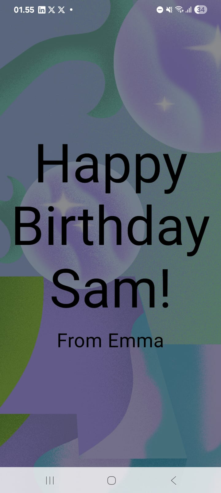

# Happy Birthday Card 🎂

Project praktikum **Pemrograman Mobile Android**  
Dibuat oleh **Dimas Dwi Fitrianto** (243307101) - Kelas 3D - Mata Kuliah Pemrogaman Mobile

---

## Deskripsi
Aplikasi sederhana berupa kartu ucapan ulang tahun menggunakan **Kotlin** dan **Jetpack Compose**.  
Fitur:
- Menampilkan teks ucapan ulang tahun
- Background gambar
- Layout sederhana dengan Composable

---

## Screenshot



---

## Cara Menjalankan
1. Clone repository:
   ```bash
   git clone https://github.com/yumisw00/HappyBirthdayCard